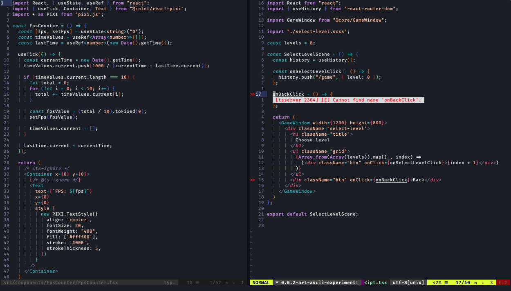
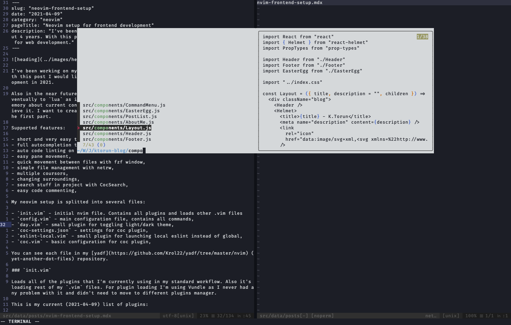

I've been working on my vim configuration from time to time now for about 4 years. With this post, I would like to go through it and show you what am I using for web development in 2021.

Also shortly, I would like to start updating my configuration and move it eventually to `lua` as it's fully supported in neovim but first I need to refresh my memory about the current configuration and I think writing about it is the best way to achieve it. I want to create few posts about this process so you can treat this one as the first part.

Supported features: 

- short and very easy to understand and use configuration,
- full autocompletion tslint engine easily accessible with just `TAB` key,
- auto code linting on save,
- easy pane movement,
- quick movement between files with fzf window,
- simple file management with netrw,
- multiple cursors,
- changing surroundings,
- search stuff in a project with CocSearch,
- easy code commenting,

My neovim setup is splitted into several files:

- `init.vim` - initial nvim file. Contains all plugins and loads other .vim files
- `config.vim` - main configuration file, contains all commands,
- `day.vim` - small plugin for toggling light/dark theme,
- `coc-settings.json` - settings for coc plugin,
- `eslint-local.vim` - small plugin for launching local eslint instead of global,
- `coc.vim` - basic configuration for coc plugin,

You can see each file in my [yadf](https://github.com/Krol22/yadf/tree/master/nvim) (yet-another-dot-files) repository.

### `init.vim`

Loads all of the plugins that I'm currently using in my standard workflow. Also, it's loading the rest of my `.vim` files. For plugin loading, I'm using Vundle as I never had any problem with it and didn't need to move to a different plugins manager.

This is my current (2021-04-09) list of plugins:

- [VundleVim/Vundle.vim](https://github.com/VundleVim/Vundle.vim) - vim plugin manager,
- [neoclide/coc.nvim](https://github.com/neoclide/coc.nvim) - VSCode autocompletion
- [neomake/neomake](https://github.com/neomake/neomake) - asynchronous code linting,
- [scrooloose/nerdcommenter](https://github.com/scrooloose/nerdcommenter) - comment functions so powerful--no comment necessary,
- [jiangmiao/auto-pairs](https://github.com/jiangmiao/auto-pairs) - insert/delete brackets, parens, quotes in pair,
- [mg979/vim-visual-multi](https://github.com/mg979/vim-visual-multi) - multiple cursors support,
- [alvan/vim-closetag](https://github.com/alvan/vim-closetag) - autoclose HTML tags,
- [Yggdroot/indentLine](https://github.com/Yggdroot/indentLine) - show vertical lines at each indentation level of code,
- [romainl/vim-qf](https://github.com/romainl/vim-qf) - vim quickfix window,
- [tpope/vim-surround](https://github.com/tpope/vim-surround) - remove and add parentheses, brackets, quotes, XML tags, and more with ease,
- [tpope/vim-vinegar](https://github.com/tpope/vim-vinegar) - netrw (built in directory browser) but better,
- [tpope/vim-sleuth](https://github.com/tpope/vim-sleuth) - automatically adjusts 'shiftwidth' and 'expandtab' based on current file,
- [luochen1990/rainbow](https://github.com/luochen1990/rainbow) - rainbow parentheses,
- [junegunn/fzf.vim](https://github.com/junegunn/fzf.vim) - fzf for vim,
- [vim-airline/vim-airline](https://github.com/vim-airline/vim-airline) - better status bar for vim,
- [vim-airline/vim-airline-themes](https://github.com/vim-airline/vim-airline-themes) - themes for status bar,

Syntax highlighting:
- [elzr/vim-json](https://github.com/elzr/vim-json) - json,
- [othree/yajs.vim](https://github.com/othree/yajs.vim) - js
- [leafgarland/typescript-vim](https://github.com/leafgarland/typescript-vim) - typescript
- [MaxMEllon/vim-jsx-pretty](https://github.com/MaxMEllon/vim-jsx-pretty) - jsx
- [peitalin/vim-jsx-typescript](https://github.com/peitalin/vim-jsx-typescript) - tsx,

And for colors I'm currently using these two plugins:
- [sainnhe/vim-color-vanilla-cake](https://github.com/sainnhe/vim-color-vanilla-cake) - light theme,
- [ntk148v/vim-horizon](https://github.com/ntk148v/vim-horizon) - dark theme,

Most of them I use without any additional configuration. For the rest of them, I have a simple configuration in the `config.vim` file.

### `config.vim`

Contains all of the configurations for neovim and plugins. In history, it was a pretty long file but now (146 lines) I'm happy with this "shorter" result. TBH I would like to shrink it even more.

I've splitted my configuration for few parts:

1. Mappings - contains basic shortcuts for nativation:

```vim
 nmap <silent> <C-h> :winc h<CR> "Ctrl + h -> move to pane on left,
 nmap <silent> <C-j> :winc j<CR> "Ctrl + j -> move to pane below,
 nmap <silent> <C-k> :winc k<CR> "Ctrl + k -> move to pane above,
 nmap <silent> <C-l> :winc l<CR> "Ctrl + l -> move to pane on right,

 nmap <silent> <C-q> :q <CR> "Ctrl + q -> quit file,
 nmap <silent> <C-s> :w <CR> "Ctrl + s -> save file,

 tnoremap <C-R> <C-\><C-n> "Ctrl + r -> exit from Terminal mode,

 nmap <silent> <C-P> :Files<CR> "Ctrl + p -> open fzf

 nmap <C-_> <leader>c<space> "Ctrl + / -> comment line under cursor
 vmap <C-_> <leader>c<space> "Ctrl + / -> comment selected lines

 nnoremap <C-f> :CocSearch<space> "Ctrl + f -> search in files,
```

The rest shortcuts that I use daily are usually set up by plugin by default. You can check the documentation for these plugins to get more information about the functionalities that they can provide. 

But apart from shortcuts defined in the Mappings section here are 4 shortcuts that I think I use the most:

- `-` open file explorer,
- `Ctrl+n` in normal mode to trigger multiple cursors,
- `Ctrl+space` triggers autocompletion menu,
- `Tab` moving inside autocompletion menu,

2. Configs - contains configuration for vim. In this part, I have my basic configuration for vim -> line numbers, indent, swap files, etc. Each file contains comments with descriptions so it should be easy for you to understand what each line does.

3. Neomake - configuration for async linters. Currently enabled makers

- javascript - eslint,
- html - htmlhint,
- cpp - clang,
- typescript - tslint,

For eslint you can see that there is an extra option set `let b:neomake_javascript_eslint_exe = GetNpmBin('eslint')`. GetNpmBin is a custom function that I use for neomake to use local project eslint instead of the global one installed in the system if there is one available. It's defined in `eslint-local.vim`. The rest of the neomake configuration is pretty standard.

4. Comments - this section contains some basic configurations for the nerdcommenter plugin.
5. fzf - configuration for showing fzf on this fancy window. On the screenshot below you can see how it looks.



### `day.vim`
`day.vim` is my small script for toggling between light and dark themes. Very simple to use, just press Ctrl-g in normal or visual mode to toggle themes between `horizon` and `vanilla-cake`. You can easily change these themes in lines 4 and 5 or by setting `g:dark_colorscheme` and `g:light_colorscheme` variables to correct values.

### `coc.vim`
It's a copied version of the example configuration for coc extension. You can see it [here](https://github.com/neoclide/coc.nvim#example-vim-configuration).

!Note - if you plan to use this configuration. After installing all plugins with `:PlugInstall` you need to install a coc-tsserver extension for coc. You can do it with the `:CocInstall` command:

```
 :CocInstall coc-tsserver
```

Apart from [coc-tsserver](https://github.com/neoclide/coc-tsserver) I use 3 more extensions [coc-emmet](https://github.com/neoclide/coc-emmet), [coc-markdownlint](https://github.com/fannheyward/coc-markdownlint) and [coc-tabnine](https://github.com/neoclide/coc-tabnine).

You can see this setup is really simple but it gives me many functionalities that I use on daily basis. If you have any suggestions what I could improve or questions about it feel free to message me on [twitter](https://twitter.com/krol22ee).

That all from me for this post see you in the next time!
